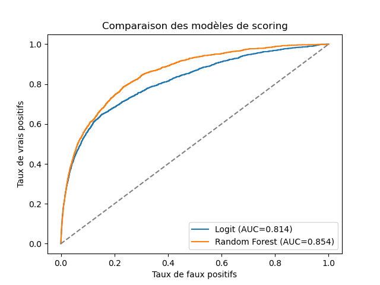
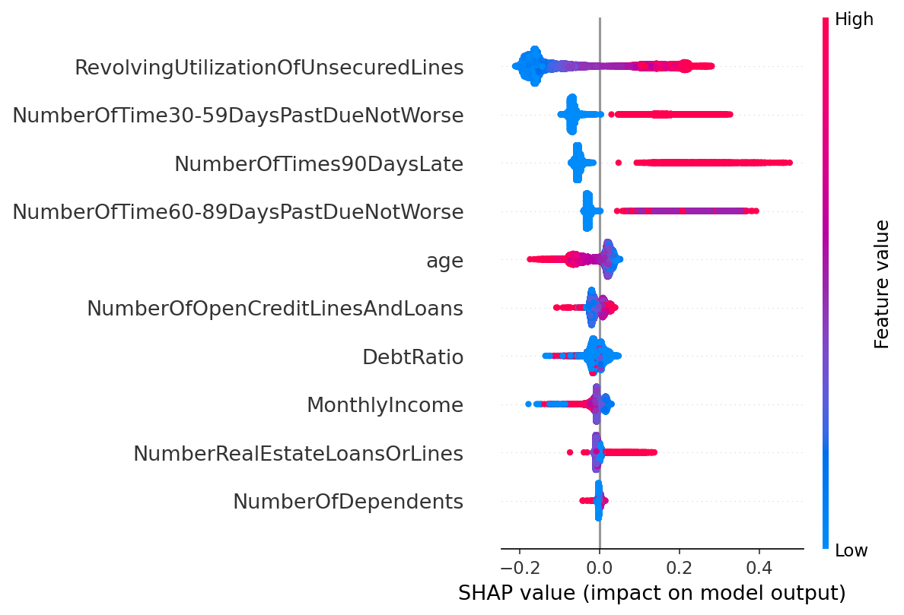

# Scoring crédit : Modélisation du risque de défaut et explicabilité

Développement d'un modèle de scoring de **probabilité de défaut (PD)** sur le dataset [Give Me Some Credit](https://www.kaggle.com/c/GiveMeSomeCredit) (Kaggle) : **150 000 emprunteurs**, 10 variables financières, taux de défaut de 6,68 %.

## Démarche

1. **Nettoyage** : traitement des valeurs manquantes (`MonthlyIncome` imputé à la médiane, `NumberOfDependents` à 0), suppression des outliers connus du dataset (âge ≤ 18, codes anormaux 96/98 sur les variables de retard)
2. **Modélisation** : comparaison régression logistique (baseline interprétable) vs Random Forest (challenger), avec `class_weight='balanced'` pour gérer le déséquilibre de classes et split stratifié train/test (80/20)
3. **Évaluation** : indicateurs réglementaires du scoring bancaire : AUC, coefficient de Gini, statistique de Kolmogorov-Smirnov (KS)
4. **Explicabilité** : analyse SHAP (TreeExplainer) pour identifier et interpréter les facteurs de risque

## Résultats

| Modèle | AUC | Gini | KS |
|---|---|---|---|
| Régression logistique | 0,814 | 0,627 | 0,495 |
| Random Forest | **0,854** | **0,708** | **0,552** |

Un KS > 0,50 indique un pouvoir discriminant élevé entre bons et mauvais payeurs.



## Facteurs de risque (SHAP)



Les deux variables dominantes sont cohérentes avec la théorie du risque de crédit :
- **`RevolvingUtilizationOfUnsecuredLines`** : un taux d'utilisation élevé du crédit renouvelable pousse fortement vers le défaut
- **Les retards de paiement passés** (30-59j, 60-89j, 90j+) : forte contribution positive au risque
- **`age`** : effet protecteur croissant avec l'âge

Cette démarche d'explicabilité répond aux exigences réglementaires bancaires : un score doit pouvoir être **justifié**, pas seulement performant.

## Reproduire

```bash
pip install pandas numpy scikit-learn shap matplotlib
# Télécharger cs-training.csv depuis Kaggle, puis :
jupyter notebook Scoring.ipynb
```
